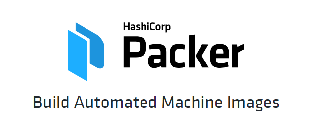

# linuxtips-packer


[](https://cloud.drone.io/aleroxac/linuxtips-packer)

Projeto de pipeline no DroneCI utilizando conteúdo assimilado sobre packer no treinamento Descomplicando Packer da LINUXtips.

## Requisitos para utilização da pipeline
- Certifique-se de que já tenha uma conta na AWS criada
- Certifique-se de que já tenha uma conta no DroneCI criada
- Ative o repositório no DroneCI, inserindo os 3 secrets e permitindo serem utilizados nos pull request
- Clone este repositório, renomei-o, faça suas alterações e commit
- Crie um novo repositório na sua conta do Github e então faça push
- Acesse o DroneCI e acompanhe a execução da pipeline
- Acesse sua conta na AWS e valide a AMI criada.

## Requisitos para ambiente de desenvolvimento
- python
- pip
- awscli
- ansible
- packer

## Configuração dos Requisitos
``` shell
# Instalando o pip, ansible e awscli
sudo apt install -y python2-pip ansible
sudo pip install awscli

# Baixando e instalando o ansible e packer
wget -o /tmp "https://releases.hashicorp.com/packer/1.6.5/packer_1.6.5_linux_amd64.zip"
unzip /tmp/packer_1.6.5_linux_amd64.zip
sudo mv packer /usr/local/bin/

# Não é obrigatório instalar o ansible e o packer localmente, mais vai facilitar teu dia a dia
```
